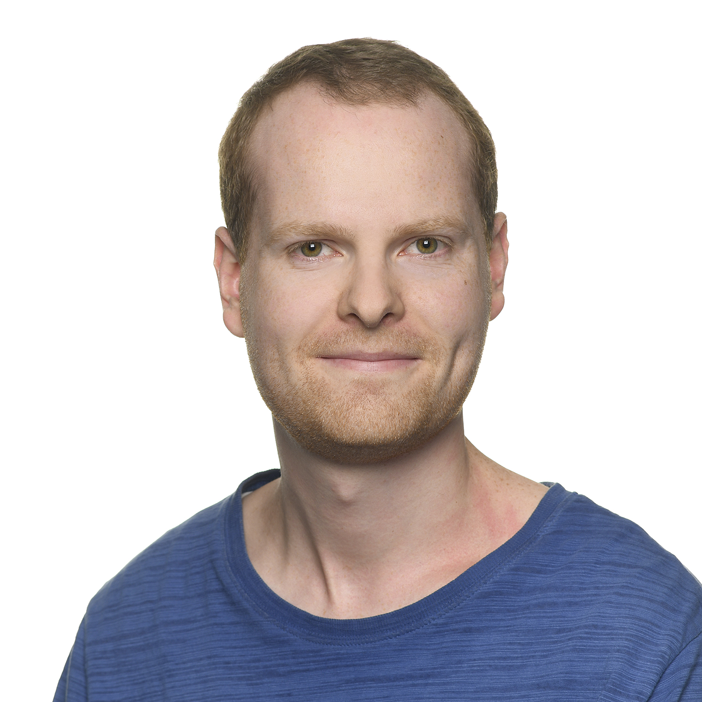

.. sblauth.github.io documentation master file, created by
   sphinx-quickstart on Sun Jan 22 11:04:18 2023.
   You can adapt this file completely to your liking, but it should at least
   contain the root `toctree` directive.

Welcome!
========

.. toctree::
   :maxdepth: 1
   :hidden:

   CV <cv>
   Publications <publications>
   Research Interests <research_interests>
   Conferences & Workshops <conferences>
   Contact <contact>

   Sebastian Blauth (`sebastian.blauth@itwm.fraunhofer.de <mailto:sebastian.blauth@itwm.fraunhofer.de>`_)

Hello, I am Sebastian Blauth, a scientific employee at `Fraunhofer ITWM <https://www.itwm.fraunhofer.de/en.html>`_. I work in the department `Transport Processes <https://www.itwm.fraunhofer.de/en/departments/tv.html>`_ in the group `Fluid Dynamical Process Design <https://www.itwm.fraunhofer.de/en/departments/tv/fluid-dynamical-process-design.html>`_. My research mainly focuses on shape optimization with particular regards to industrial applications and the development of efficient solution methods for such problems.

Before becoming a scientific employee at Fraunhofer ITWM, I was a PhD student at TU Kaiserslautern (now RPTU Kaiserslautern Landau) and Fraunhofer ITWM under the supervision of `René Pinnau <https://www.mathematik.uni-kl.de/en/techno/people/head/pinnau>`_ and `Christian Leithäuser <https://www.itwm.fraunhofer.de/en/departments/tv/staff/christian-leithaeuser.html>`_, where I worked on PDE constrained shape optimization and optimal control in the field of microchannel systems. If you are interested, you can find my PhD Thesis `here <https://doi.org/10.24406/publica-fhg-283725>`_. Previous to that, I have studied mathematics (Bachelor) and industrial mathematics (Master) at TU Kaiserslautern. 

I am the main developer of the software package `cashocs <https://cashocs.readthedocs.io/en/latest/>`_, which is an open source software for solving (arbitrary) shape optimization and optimal control problems in python, based on the finite element framework `FEniCS <https://fenicsproject.org/>`_. 

